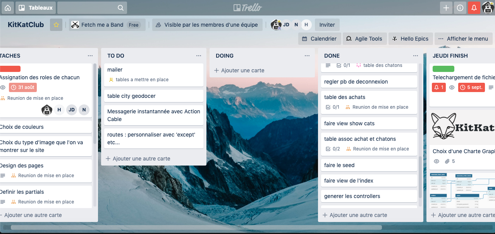

# README KITKATCLUB #

___
1- Github du groupe Fetch me a band
2- Site Heroku
3- Attention Bien lire le WIKI c'est tres important

- <https://kitkatclub.herokuapp.com/> :boom:
- <https://git.heroku.com/kitkatclub.git> :boom:
  
___

- Ruby version 2.5.1
- Rails version 5.2.3
- CSS : Bootstrap
  
___

## Contributeurs ##

- ©Jean-Baptiste DEMENET
- slack: @Jean-Baptiste :smile:
- ~~©Hugo CORDILLOT~~
- ~~slack: @Hugo Cordillot~~ :imp:
- ©Nazanin FARSHAD
- slack: @Nazanin :smile:
- ©Jean-Marc DARDY
- slack: @JM :smile:
  
### Mentor ###

- Anthony Amar
- slack: @anthonyamar :rocket:
  
#### Projet fait grace a la formation ####

[©The Hackig Project](<https://www.thehackingproject.org/fr>) :alien:
  
##### Pour Github #####

- JM doit mettre en contributeur tout le monde
- dirige toi via ton terminal dans le dossier que tu souhaites
- git clone <https://github.com/jb1011/kitkat3.git>
- cd kitkatclub
- bundle install
- rails db:create
=> Puis pour commencer à travailler :
- git checkout master
- git pull origin master
- git branch nom_de_ta_branche
- git checkout nom_de_ta_branche
  
  Tu peux alors coder normalement / puis
  
- git add .
- git commit -m "ton commentaire"
  
##### Pour Merger #####

- git checkout master
- git pull origin master
- git checkout nom_de_ta_branche
- git merge master
- git checkout master
- git merge nom_de_ta_branche
- git push origin master

##### BDD View #####

___

##### TRELLO avant celui de FeFe #####

